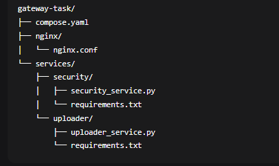
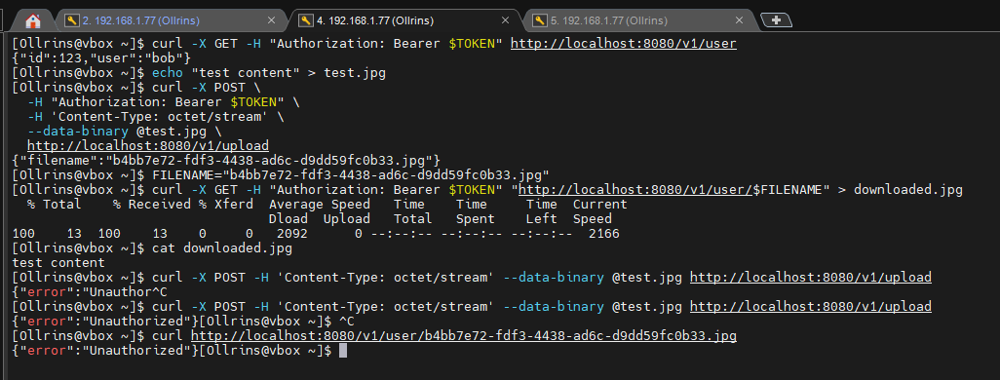

# Домашнее задание: Микросервисы: принципы

## Задача 1: API Gateway

### Сравнительная таблица решений для API Gateway

| Возможность | NGINX | Kong | Traefik | Envoy | Spring Cloud Gateway | AWS API Gateway | API7 Enterprise |
|-------------|-------|------|---------|-------|---------------------|-----------------|-----------------|
| **Маршрутизация на основе конфигурации** | ✅ (файлы .conf) | ✅ (админ API / декларативная) | ✅ (автоматическая из Docker/K8s) | ✅ (файлы .yaml / xDS) | ✅ (Java DSL / YAML) | ✅ (AWS Console, CDK, OpenAPI) | ✅ (ADC, K8s CRD, REST Admin API) |
| **Проверка аутентификации** | ⚠️ (через lua-скрипты или модули) | ✅ (JWT, Key-Auth, OAuth2, LDAP) | ✅ (JWT, Forward Auth) | ⚠️ (через external auth filter) | ✅ (Spring Security) | ✅ (IAM, Cognito, Lambda authorizers) | ✅ (JWT, OIDC, OAuth2, mTLS, FIPS, RBAC) |
| **Терминация HTTPS** | ✅ | ✅ | ✅ | ✅ | ✅ | ✅ | ✅ |
| **Лимитирование запросов** | ✅ (через модули) | ✅ (встроенный rate-limiting) | ✅ (middleware) | ✅ | ✅ | ✅ (встроенное throttling) | ✅ (встроенное, расширенное) |
| **Логирование и мониторинг** | ✅ (access_log, metrics module) | ✅ (Prometheus, StatsD) | ✅ (Prometheus, Tracing) | ✅ (отличные метрики) | ✅ (Micrometer) | ✅ (CloudWatch, X-Ray) | ✅ (Prometheus, Grafana, OpenTelemetry, Datadog) |
| **Динамическое обновление конфига** | ❌ (требует reload) | ✅ (через API) | ✅ (автоматически) | ✅ (через xDS) | ⚠️ (требует перезапуска) | ✅ (мгновенно через AWS API) | ✅ (etcd, реальное время) |
| **Простота настройки** | ⭐⭐⭐⭐ | ⭐⭐⭐ | ⭐⭐⭐⭐⭐ | ⭐⭐ | ⭐⭐⭐ | ⭐⭐⭐⭐⭐ (fully managed) | ⭐⭐⭐⭐ |
| **Производительность** | ⭐⭐⭐⭐⭐ | ⭐⭐⭐⭐ | ⭐⭐⭐⭐ | ⭐⭐⭐⭐⭐ | ⭐⭐⭐ | ⭐⭐⭐ (есть лимиты, cold start) | ⭐⭐⭐⭐⭐ (23k QPS/ядро) |
| **Поддержка gRPC** | ⚠️ (ограниченная) | ✅ | ✅ | ✅ | ✅ | ❌ (только REST, HTTP, WebSocket) | ✅ |
| **Service Discovery** | ⚠️ (через DNS или сторонние модули) | ✅ (Consul, K8s) | ✅ (встроенная) | ✅ (через xDS) | ✅ (Eureka, K8s) | ✅ (через AWS services) | ✅ (K8s, Consul, Nacos, Eureka, DNS) |
| **Cloud Lock-in** | Нет | Низкий | Нет | Нет | Нет | **Очень высокий** | **Нет** (Apache 2.0) |
| **Стоимость** | Бесплатно | OSS бесплатно; Enterprise платно | Бесплатно (OSS) | Бесплатно | Бесплатно | **Платно за запросы** ($1/млн) | **Платно** (но дешевле Kong) |
| **Поддержка протоколов** | HTTP, TCP, UDP | HTTP, gRPC, TCP, UDP, WebSocket | HTTP, gRPC, TCP, UDP, WebSocket | HTTP, gRPC, TCP, UDP | HTTP, gRPC, WebSocket | REST, HTTP, WebSocket | HTTP/1.1, HTTP/2, HTTP/3, gRPC, TCP, UDP, MQTT |
| **API Management** | ❌ | ✅ (Enterprise) | ❌ (только через Hub) | ❌ | ❌ | ✅ (полный цикл) | ✅ (полный цикл, портал) |

### Мой выбор: **Kong API Gateway**

**Обоснование выбора:**

1. **Из коробки решает все три требования**:
   - Маршрутизация через declarative config или Admin API
   - Встроенная поддержка JWT, OAuth2, Key-Auth (не нужно писать lua-скрипты)
   - HTTPS termination с поддержкой SNI

2. **Почему не NGINX** — хотя NGINX быстрее, для аутентификации пришлось бы писать lua-скрипты или использовать OpenResty, что усложняет поддержку.

3. **Почему не Traefik** — он идеален для Kubernetes, но для классической инфраструктуры Kong даёт больше гибкости и лучшую производительность под высокой нагрузкой.

4. **Почему не Envoy** — слишком низкоуровневый, требует глубоких знаний для настройки аутентификации.

5. **Почему не Spring Cloud Gateway** — привязка к JVM, сложнее в эксплуатации для DevOps (требует Java-разработчиков).

6. **Почему не AWS API Gateway** — полная привязка к AWS, не работает локально (нельзя тестировать на виртуальной машине разработчика), нет нативной поддержки gRPC, при росте нагрузки стоимость растёт линейно (плата за каждый запрос), нет возможности развернуть on-premise или в другом облаке.

7. **Почему не API7 Enterprise** — хотя он производительнее Kong (23k QPS/ядро) и дешевле (~$1 260 против ~$5 350 в год), его экосистема плагинов менее зрелая (100+ против 300+ у Kong), сообщество меньше, документации и готовых решений для типовых задач пока недостаточно. Kong имеет более долгую историю enterprise-внедрений и проверен временем в крупных проектах.

**Для нашего интернет-магазина** Kong даёт баланс между функциональностью, производительностью и простотой эксплуатации.
При безлимитных ресурсах API7 Enterprise)

---

## Задача 2: Брокер сообщений

### Сравнительная таблица брокеров сообщений

| Возможность | RabbitMQ | Apache Kafka | Redis Pub/Sub | NATS | ActiveMQ Artemis |
|-------------|----------|--------------|---------------|------|-------------------|
| **Кластеризация для надёжности** | ✅ (queues mirroring) | ✅ (копии партиций) | ⚠️ (Sentinel/Cluster, но не основное предназначение) | ✅ (Leaf nodes / Super cluster) | ✅ (master-slave) |
| **Хранение сообщений на диске** | ✅ | ✅ (по умолчанию) | ❌ (в основном в памяти) | ⚠️ (опционально через JetStream) | ✅ |
| **Высокая скорость работы** | ⭐⭐⭐⭐ (~50k msg/s) | ⭐⭐⭐⭐⭐ (~100k+ msg/s) | ⭐⭐⭐⭐⭐ (но в память) | ⭐⭐⭐⭐⭐ (очень низкая задержка) | ⭐⭐⭐ |
| **Поддержка форматов сообщений** | ✅ (JSON, XML, Protobuf, binary) | ✅ (любые) | ✅ (строки/байты) | ✅ (Protobuf, JSON, binary) | ✅ (JMS, любые) |
| **Разделение прав доступа** | ✅ (vhost + user permissions) | ✅ (ACL по темам) | ❌ (очень простые) | ✅ (Nkeys, JWT, ACL) | ✅ (JAAS, role-based) |
| **Простота эксплуатации** | ⭐⭐⭐⭐ | ⭐⭐ | ⭐⭐⭐⭐⭐ | ⭐⭐⭐⭐ | ⭐⭐⭐ |
| **Гарантии доставки** | at-least-once (confirm) | exactly-once (transactions) | at-most-once | at-least-once / exactly-once | at-least-once |
| **Поддержка очередей и тем** | оба | темы (log-based) | publish/subscribe | оба (через JetStream) | оба |
| **Документация и сообщество** | огромное | огромное | большое | растущее | среднее |

### Мой выбор: **Apache Kafka**

**Обоснование выбора:**

1. **Полное соответствие требованиям**:
   - ✅ Кластеризация с репликацией (даже при отказе 2 брокеров из 3 данные не теряются)
   - ✅ Все сообщения хранятся на диске с настраиваемым retention
   - ✅ Высокая скорость (миллионы сообщений в секунду на кластере)
   - ✅ Любые форматы (сериализуем в JSON/Avro/Protobuf)
   - ✅ ACL с детализацией read/write на топики
   - ⚠️ Простота эксплуатации — сложнее RabbitMQ, но управляется через инструменты (Kafka UI, Cruise Control)

2. **Почему не RabbitMQ** — при больших объёмах данных (логи заказов, события корзины, аналитика) RabbitMQ начинает деградировать из-за хранения очередей в памяти и на диске менее эффективно, чем Kafka.

3. **Почему не Redis** — не хранит данные на диске (основной недостаток), не подходит для надёжной доставки критичных событий (заказы, платежи).

4. **Почему не NATS** — хорошая альтернатива, но JetStream (постоянное хранение) появился недавно, экосистема инструментов меньше, чем у Kafka.

**Для интернет-магазина** Kafka идеально подходит для:
- Потока заказов (обеспечивает exactly-once доставку)
- Событий корзины и аналитики
- Логов и метрик (Kafka Connect → ClickHouse/Elasticsearch)
- CDC (Change Data Capture) между сервисами

**Недостаток Kafka** (сложность эксплуатации) решается наймом одного опытного SRE или использованием Managed Kafka (Confluent Cloud, Yandex Managed Kafka).

---

## Задача 3: API Gateway * (практическая)

### Решение: конфигурация NGINX + docker-compose

#### Структура проекта:

  
   

Проверка работоспособности

  
   

